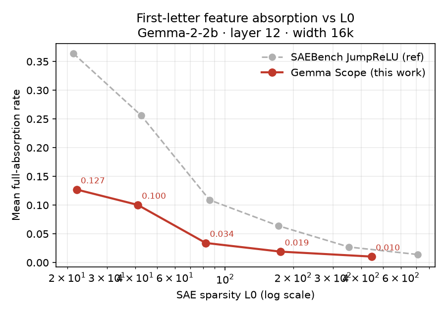
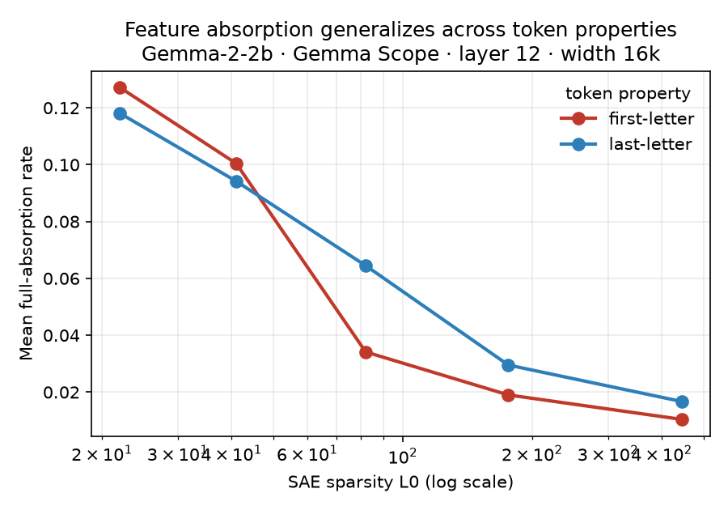

# Absorption Atlas

**📄 Technical report: [`paper/paper.pdf`](paper/paper.pdf)** — the full 15-page write-up:
a cross-metric, cross-model (Gemma-2-2B & 2-9B) metric-validity audit of SAE feature absorption.

**➡️ Short version: [`WRITEUP.md`](WRITEUP.md)** — *Does the SAE-absorption metric over-report for
non-spelling features?* (a metric-validity note; the honest headline result of this repo).

**Does SAE feature absorption generalize beyond first-letter spelling?**

Sparse autoencoders (SAEs) are meant to decompose a language model's activations into
reliable, monosemantic features. **Feature absorption** (Chanin et al.,
[2409.14507](https://arxiv.org/abs/2409.14507)) is a known failure mode: a specific latent
"absorbs" the direction of a more general one, so the general latent silently fails to fire —
e.g. a *starts-with-L* latent stays dark on *lion* because a dedicated *lion* latent swallowed
the direction. This undermines the SAE-as-decomposition premise.

Today absorption is measured on essentially **one task**: "token starts with letter X". Whether
absorption is a **general** SAE failure mode or a **quirk of alphabetical spelling** is open.
This project measures absorption across a battery of other objective, tokenizer-derivable token
properties (last-letter, is-capitalized, ALL-CAPS, is-numeric, common suffixes) on off-the-shelf
public SAEs (Gemma Scope), to answer that question.

## Status

**Week-1 gate: PASSED** (2026-07-18). Reproduced first-letter feature absorption on current Gemma
Scope SAEs (Gemma-2-2b, layer 12, width 16k), 200 prompts/letter, on GPU. Rather than a single
number, an **L0 sweep** reproduces the paper's central law — absorption rises steeply as L0 falls —
and sits a consistent ~2.6–3.4× *below* SAEBench's own JumpReLU reference, exactly as expected for
Google's better-trained Gemma Scope SAEs:



| L0 | mean full-absorption |
|----|----------------------|
| 22 | 0.127 |
| 41 | 0.100 |
| 82 | 0.034 |
| 176 | 0.019 |
| 445 | 0.010 |

Per-letter variance is wide with `s` (Chanin's worked-example letter, *short*) among the highest.
Cross-checked against published SAEBench/Absorption results — see
[`results/gate/VERIFICATION.md`](results/gate/VERIFICATION.md).

**First generalization result: absorption is NOT specific to first-letter.** The same measurement on
**last-letter** (Gemma-2-2b, layer 12, 16k) gives a curve of the same shape and comparable — at mid/high
L0, *higher* — magnitude:



| L0 | first-letter | last-letter |
|----|--------------|-------------|
| 22  | 0.127 | 0.118 |
| 41  | 0.100 | 0.094 |
| 82  | 0.034 | 0.064 |
| 176 | 0.019 | 0.030 |
| 445 | 0.010 | 0.017 |

Last-letter is still a *letter* property (close to first-letter); the stronger test of generality is
the **binary** properties (is-capitalized / is-numeric / has-suffix), which need a separate single-class
orchestration — the `is-capitalized` study, including the cross-metric disagreement that became the
headline result, is in the [final report](paper/paper.pdf).

## Method (from Chanin et al. + their reference code)

For a concept, three stages (all from the [`sae-spelling`](https://github.com/lasr-spelling/sae-spelling) repo):

1. **LR probe** on the residual stream → the ground-truth concept direction.
2. **k-sparse probing** → the "main"/split SAE latents that predict the concept.
3. **IG-ablation absorption calculator** → on tokens where the probe fires but the main latents
   don't, integrated-gradient attribution confirms a single, probe-aligned latent causally
   carries the concept. `absorption_rate = #absorbed / #probe-true-positives`, per concept.

Extending to a new property needs its own ICL formatter + logit-diff `metric_fn` + probe +
k-sparse results; the calculator and aggregation are reused. Key gotchas: recalibrate the
IG-gap threshold per property; verify a clean "main" latent even exists via the k-sparse F1
curve; layer ceiling ≤17 for Gemma-2-2b.

## Setup

```bash
# 1. clone the upstream methodology repo alongside this one (gitignored here)
git clone --depth 1 https://github.com/lasr-spelling/sae-spelling.git
cd sae-spelling && uv venv --python 3.11 .venv && uv pip install --python .venv -e . && cd ..

# 2. Gemma-2-2b is HF-gated: accept the license at huggingface.co/google/gemma-2-2b,
#    then put a read token in a gitignored .env:  HF_TOKEN=hf_...
```

## Run the gate

```bash
cd sae-spelling && .venv/bin/python ../run_gate.py --layer 12 --width 16000 --max-prompts 200
```

Produces `results/gate/gate_summary.json` with the per-letter and mean absorption rate.

## Prior art

- Chanin et al., *A is for Absorption* ([2409.14507](https://arxiv.org/abs/2409.14507)) — defines
  + measures absorption, first-letter only.
- SAEBench ([2503.09532](https://arxiv.org/abs/2503.09532)) — standardizes the metric, first-letter only.

## License / credit

MIT — see [`LICENSE`](LICENSE). Builds directly on the MIT-licensed
[`sae-spelling`](https://github.com/lasr-spelling/sae-spelling) implementation by the LASR
spelling team (cloned alongside, not vendored). This repo adds the multi-property extension +
replication.

## Author

**Jakub Dvořák** — engineer & founder moving into AI-safety research (mechanistic
interpretability, MFF UK Prague). Site: [kubadvorak.com](https://kubadvorak.com) ·
Writing: [kubadvorak.substack.com](https://kubadvorak.substack.com) ·
Contact: hi@kubadvorak.com
